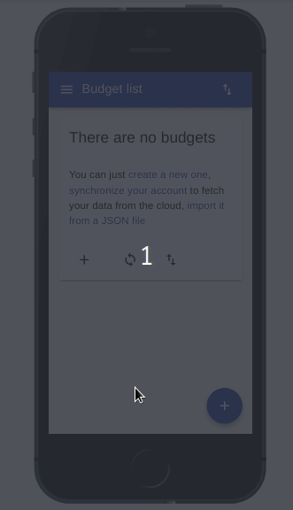
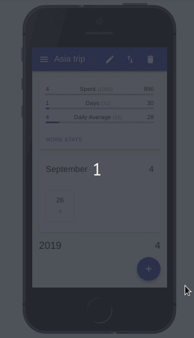
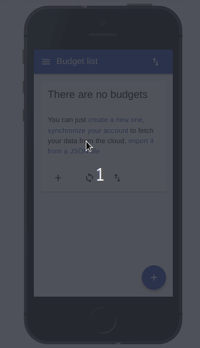
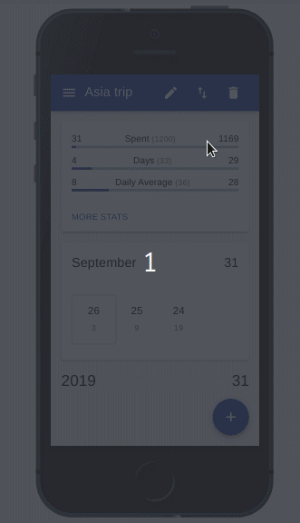
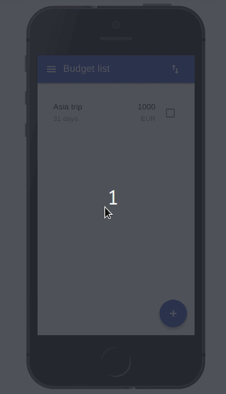

App to track the expenses during a period of time. 

    It is quite useful for keeping track of travel budgets. 

[
**Budget Tracker**](https://carlosvin.github.io/budget-tracker) is a [PWA](https://en.wikipedia.org/wiki/Progressive_web_applications), so you can easily use it from any device by just opening following url: https://carlosvin.github.io/budget-tracker.

# Features

## Create a budget
First time application is loaded there is no information, you can start using it by adding a new budget, importing budgets or if you already are using  [
Budget Tracker](https://carlosvin.github.io/budget-tracker) from other device, you can [Synchronize devices][synchronize devices].

## Add new expense

## Synchronize devices
Data synchronization between devices.

## Statistics
This application generates statistics per budget. It can also generate statistics for a group of budgets.

## Edit categories

