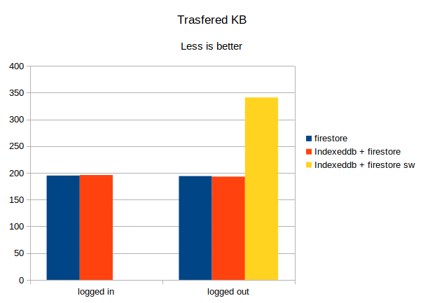
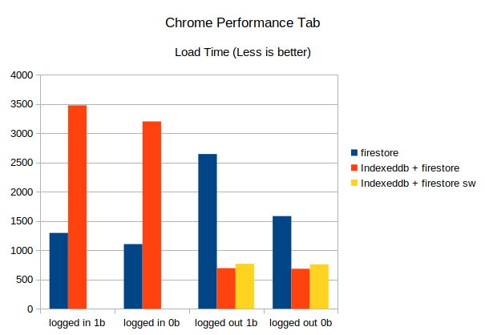
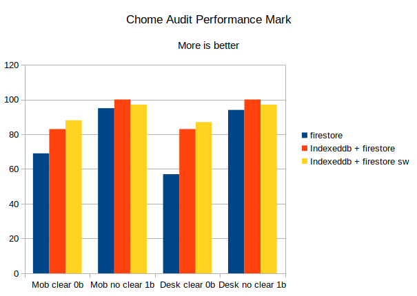

# Performance comparison

We will compare load time using different architectural approaches about application storage.

## Firestore only
CRA using only firestore as persistence layer.

### Performance
#### Logged in (1 budget)
- 38 msLoading
- 804 msScripting
- 9 msRendering
- 6 msPainting
- 230 msSystem
- 209 msIdle
- 1296 msTotal
#### Logged in (0 budget)
- 31 msLoading
- 659 msScripting
- 5 msRendering
- 12 msPainting
- 219 msSystem
- 179 msIdle
- 1105 msTotal

#### Logged out (1 budget)
- 17 msLoading
- 839 msScripting
- 13 msRendering
- 4 msPainting
- 180 msSystem
- 1593 msIdle
- 2646 msTotal

#### Logged out (0 budget)
- 26 msLoading
- 676 msScripting
- 9 msRendering
- 4 msPainting
- 109 msSystem
- 760 msIdle
- 1584 msTotal

### Audits
#### Mobile Slow: clear storage, 0 budgets
69 91 93 100
- First Contentful Paint  3.2 s
- Speed Index             4.9 s
- Time to Interactive     5.5 s
- First Meaningful Paint  3.2 s
- First CPU Idle          5.5 s
- Max Potential First Input Delay 150 ms

#### Mobile Slow: Do not clear storage, 1 budget
95 97 93 100
- First Contentful Paint  0.8 s
- Speed Index             1.2 s
- Time to Interactive     3.8 s
- First Meaningful Paint  0.8 s
- First CPU Idle          3.8 s
- Max Potential First Input Delay 130 ms

#### Desktop Slow: clear storage, 0 budgets
57 91 93 100
- First Contentful Paint  3.1 s
- Speed Index             5.1 s
- Time to Interactive     7.5 s
- First Meaningful Paint  3.1 s
- First CPU Idle          7.5 s
- Max Potential First Input Delay 230 ms

#### Desktop Slow: Do not clear storage, 1 budget
94 97 93 100
- First Contentful Paint  0.9 s
- Speed Index             1.3 s
- Time to Interactive     4.0 s
- First Meaningful Paint  0.9 s
- First CPU Idle          4.0 s
- Max Potential First Input Delay 150 ms

### Network
#### Logged in
- 19 requests
- 195 KB transferred
- 1.1 MB resources
- Finish: 2.30 s
- DOMContentLoaded: 206 ms
- Load: 575 ms

#### Logged out
- 19 requests
- 194 KB transferred
- 1.1 MB resources
- Finish: 2.37 s
- DOMContentLoaded: 275 ms
- Load: 607 ms

## Primary Indexed DB, secondary firestore
Two persistence layers, first level local storage in IndexedDB secondary in Firestore.

### Performance 
#### Logged in (1 budget)
- 17 msLoading
- 673 msScripting
- 13 msRendering
- 4 msPainting
- 328 msSystem
- 2443 msIdle
- 3478 msTotal

#### Logged in (0 budget)
- 13 msLoading
- 706 msScripting
- 8 msRendering
- 7 msPainting
- 244 msSystem
- 2227 msIdle
- 3203 msTotal

#### Logged out (1 budget)
- 11 msLoading
- 402 msScripting
- 6 msRendering
- 18 msPainting
- 111 msSystem
- 147 msIdle
- 694 msTotal

#### Logged out (0 budget)
- 22 msLoading
- 363 msScripting
- 7 msRendering
- 5 msPainting
- 113 msSystem
- 174 msIdle
- 684 msTotal

### Audits 

#### Mobile Slow clear storage
83 91 93 100
- First Contentful Paint  2.4 s
- Speed Index             3.1 s
- Time to Interactive     5.1 s
- First Meaningful Paint  2.4 s
- First CPU Idle          5.1 s
- Max Potential First Input Delay 120 ms

#### Mobile Slow: Do not clear storage, 1 budget
100 97 86 100
- First Contentful Paint  0.7 s
- Speed Index             0.8 s
- Time to Interactive     1.3 s
- First Meaningful Paint  0.7 s
- First CPU Idle          1.3 s
- Max Potential First Input Delay 130 ms

#### Desktop Slow: clear storage, 0 budgets
83 91 93 100
- First Contentful Paint  2.4 s
- Speed Index             3.0 s
- Time to Interactive     5.1 s
- First Meaningful Paint  2.4 s
- First CPU Idle          5.1 s
- Max Potential First Input Delay 120 ms

#### Desktop Slow: Do not clear storage, 1 budget
100 97 86 100
- First Contentful Paint  0.7 s
- Speed Index             0.8 s
- Time to Interactive     1.2 s
- First Meaningful Paint  0.7 s
- First CPU Idle          1.2 s
- Max Potential First Input Delay 110 ms

### Network
#### Logged in
- 33 requests
- 196 KB transferred
- 1.1 MB resources
- Finish: 34.16 s
- DOMContentLoaded: 170 ms
- Load: 197 ms

#### Logged out
- 18 requests
- 193 KB transferred
- 780 KB resources
- Finish: 2.21 s
- DOMContentLoaded: 184 ms
- Load: 211 ms

## Primary Indexed DB, secondary firestore in service worker
Two persistence layers, first level local storage in IndexedDB secondary in Firestore executed in Service Worker context.

### Performance 
#### Logged in (1 budget)
?
#### Logged in (0 budget)
?

#### Logged out (1 budget)
- 32 msLoading
- 429 msScripting
- 6 msRendering
- 4 msPainting
- 69 msSystem
- 228 msIdle
- 768 msTotal

#### Logged out (0 budget)
- 16 msLoading
- 457 msScripting
- 8 msRendering
- 7 msPainting
- 73 msSystem
- 198 msIdle
- 759 msTotal

### Audits 

#### Mobile Slow: clear storage, 0 budgets
88 91 86 100
- First Contentful Paint  2.8 s
- Speed Index             3.1 s
- Time to Interactive     3.5 s
- First Meaningful Paint  3.5 s
- First CPU Idle          3.5 s
- Max Potential First Input Delay 140 ms

#### Mobile Slow: Do not clear storage, 1 budget
97 97 86 100
- First Contentful Paint  2.0 s
- Speed Index             2.2 s
- Time to Interactive     2.8 s
- First Meaningful Paint  2.0 s
- First CPU Idle          2.8 s
- Max Potential First Input Delay 170 ms

#### Desktop Slow: clear storage, 0 budgets
87 91 86 100
- First Contentful Paint  2.8 s
- Speed Index             3.1 s
- Time to Interactive     3.6 s
- First Meaningful Paint  3.6 s
- First CPU Idle          3.6 s
- Max Potential First Input Delay 120 ms

#### Desktop Slow: Do not clear storage, 1 budget
97 97 86 100
- First Contentful Paint  2.0 s
- Speed Index             2.2 s
- Time to Interactive     2.8 s
- First Meaningful Paint  2.0 s
- First CPU Idle          2.8 s
- Max Potential First Input Delay 130 ms

### Network
#### Logged in
?
#### Logged out
- 11 requests
- 341 KB transferred
- 847 KB resources
- Finish: 873 ms
- DOMContentLoaded: 341 ms
- Load: 666 ms

